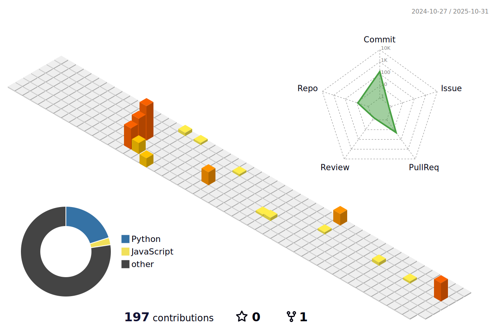

<h1 align="center">
  
  
    Helloooo  
  
  
</h1>

  

  I'm Daniela, a  SAP Integration Consultant and also a weekend-time Game Developer

 

<h2 align="left">Contact Me</h2>
<table border="0" align="center">
  <tr>
    <td>
        
        <b>Discord</b>
    </td>
    <td><i>psyoops</i></td>
    <td>📫<b>Mail</b></td>
    <td><i>danielalimaa.ds@gmail.com</i></td>
    <td>🌐<b>All my links</b></td>
    <td><i><a href="https://taplink.cc/limaa.ds" target="_blank">taplink.cc/limaa.ds</a></i></td>
  </tr>
</table>

<h2 align="left">About:</h2>

🔭 I’m currently working on my game called Caligo Quest with my sister (artist)

🌱 I’m currently learning C#, C++ and Unity

❤️ I love pixel art games

<h2 align="left">Language and tools</h2>

  
  
  
  
  
  
  
  
  
  
  
  
  
  
  
  
  
  
  
  
  

  
  
  
  
  
  
  
  
  
  
  
  
  
  
  
  
  
  
  
  
  

  
  
  
  
  
  
  
  
  

  

<!--
 
 
 

